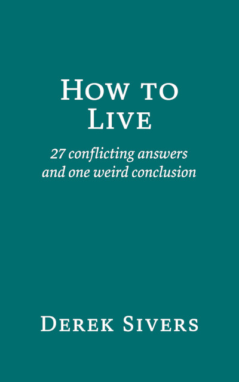

# 如何生活

《如何生活》是 [*How To Live: 27 conflicting answers and one weird conclusion*](https://sive.rs/h) 这本书的个人中文译本，原作者是 *Derek Sivers*。

## 关于作者

[*Derek Sivers*](https://sive.rs/about) 是一个企业家，发明家，音乐家，世界旅行者，也是一个 [TED](https://www.ted.com/) 演讲者。
